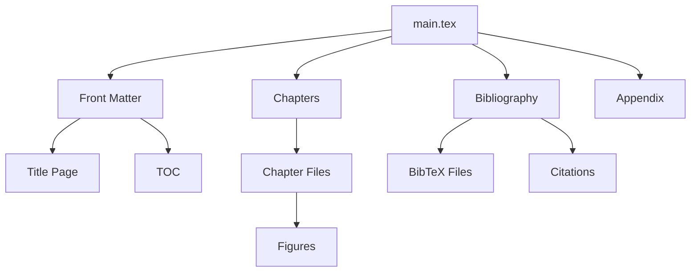

# System Patterns

## Document Architecture
1. Main Document (main.tex)
   - Document class configuration
   - Package imports
   - Custom command definitions
   - Document structure

2. Chapter Organization
   - Separate directory for each chapter
   - Dedicated figures subdirectory
   - Clear separation of content

3. Front Matter
   - Title page
   - Abstract
   - Acknowledgments
   - Table of contents

4. Bibliography Management
   - BibTeX-based
   - IEEE citation style
   - Multiple bibliography files support

## Design Patterns
1. Content Separation
   - Content in chapter files
   - Styling in LaTeX directory
   - References in BibTeX directory

2. Figure Management
   - Dedicated figures directories
   - Consistent naming convention
   - Subfigure support

3. Custom Commands
   - Project metadata
   - Author information
   - Institution details
   - Date formatting

4. Build Process
   - Multi-pass compilation
   - Automated through batch file
   - Clear error reporting

## Component Relationships

## Conventions
1. File Organization
   - Separate directories for different content types
   - Clear file naming
   - Modular structure

2. Code Style
   - Consistent indentation
   - Clear section markers
   - Documented custom commands

3. Documentation
   - Chapter-level documentation
   - Figure descriptions
   - Bibliography entries 